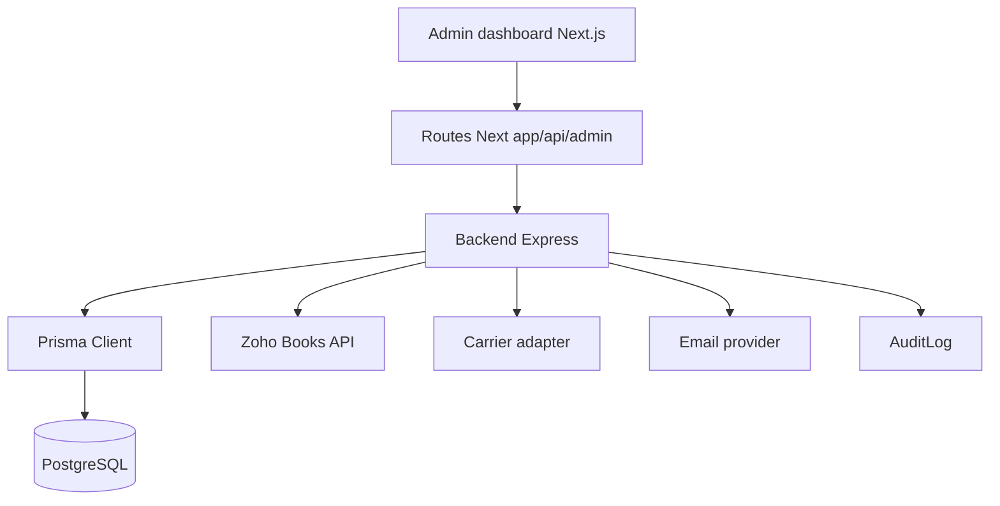
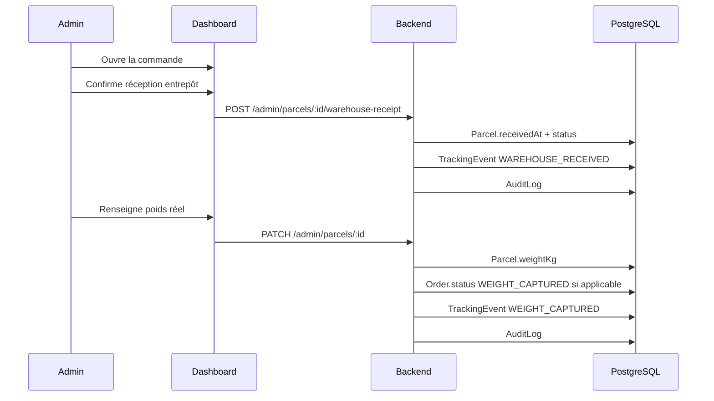
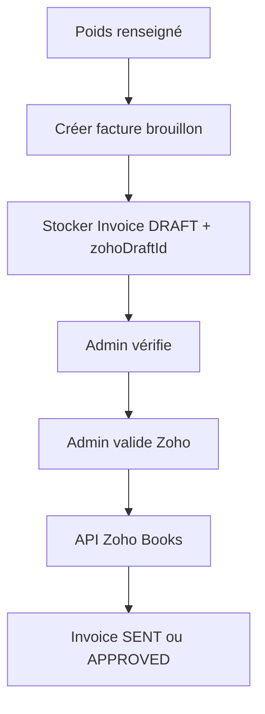
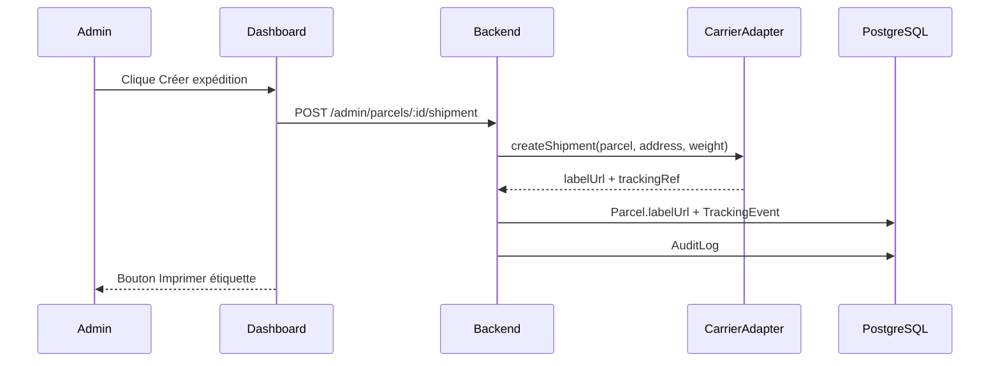
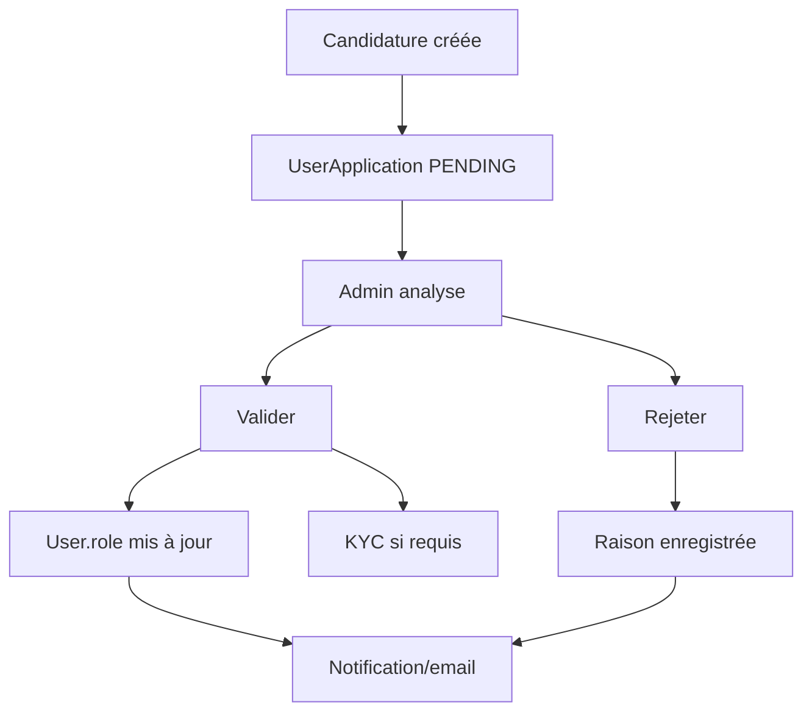

# Backoffice admin ops

Ce document décrit la cible du backoffice admin pour les opérations LaSolution :

- renseigner le poids réel des colis après réception à l'entrepôt ;
- valider les factures créées en brouillon dans Zoho Books ;
- changer le statut d'une commande ou d'une demande de transport ;
- envoyer de la communication aux clients et partenaires ;
- renseigner la date d'expédition ;
- corriger une donnée mal renseignée par un client ;
- imprimer l'étiquette d'expédition liée à un colis ;
- gérer les utilisateurs et valider ou rejeter les candidatures partenaires.

Il part de l'état réel du projet et détaille l'architecture à mettre en place ensuite.

## Etat actuel du projet

### Stack existante

Le projet utilise :

- Next.js côté interface web et backoffice ;
- Express côté backend API ;
- Prisma comme ORM ;
- PostgreSQL comme base de données ;
- NextAuth/JWT pour l'authentification ;
- un contrôle d'accès par rôle côté middleware et backend ;
- des migrations Prisma dans `backend/prisma/migrations/`.

La source de vérité du modèle de données est :

- `backend/prisma/schema.prisma`

Les documents déjà utiles sont :

- `docs/er-diagram.md` pour la vue relationnelle ;
- `docs/state-machines.md` pour les statuts métier ;
- `docs/integrations-zoho-psp.md` pour Zoho et les paiements ;
- `docs/carrier-labels.md` pour les transporteurs et les étiquettes.

### Données déjà disponibles

Les tables déjà présentes couvrent une grande partie du besoin :

| Domaine | Tables existantes |
| --- | --- |
| Utilisateurs | `User`, `RefreshToken`, `PasswordResetToken`, `SecurityEvent` |
| Roles et candidatures | `UserApplication`, `KycSubmission` |
| Commandes | `Order`, `OrderLine`, `OrderType` |
| Colis | `Parcel`, `TrackingEvent`, `IncidentReport` |
| Facturation | `Invoice`, `InvoiceLine`, `Payment` |
| Zoho / paiement | `PaymentProvider`, `PaymentMethodConfig`, `WebhookEvent` |
| Wallets et commissions | `Wallet`, `LedgerEntry`, `PayoutRequest`, `CommissionStatement` |
| Livraison | `DeliveryJob`, `DriverShift` |
| Missions | `Announcement`, `Mission` |
| Communication | `InAppMessage` |
| Audit | `AuditLog` |

Les rôles déjà définis dans Prisma sont :

- `admin`
- `client`
- `relais`
- `solupacker`
- `solu_livreur`
- `ambassadeur`

### Backoffice déjà présent

Le dashboard existe déjà sous `app/dashboard/`.

Les zones importantes sont :

- `app/dashboard/page.tsx`
- `app/dashboard/commandes/page.tsx`
- `app/dashboard/commandes/[id]/page.tsx`
- `app/dashboard/commandes/[id]/CommandeDetailClient.tsx`
- `app/dashboard/utilisateurs/page.tsx`
- `app/dashboard/utilisateurs/UtilisateursTable.tsx`
- `app/dashboard/demandes/page.tsx`
- `app/dashboard/demandes/DemandesClient.tsx`

Le backoffice est déjà protégé par rôle `admin` via le middleware applicatif. Les routes Next sous `app/api/admin/...` servent de proxy sécurisé entre l'interface Next.js et l'API Express.

### API déjà présente

Les routes backend principales sont :

- `backend/src/routes/ordersParcels.js`
- `backend/src/routes/index.js`
- `backend/src/routes/authRoutes.js`
- `backend/src/routes/missions.js`
- `backend/src/routes/shippingRequests.js`

Il existe déjà des routes ou briques pour :

- lister les commandes ;
- consulter le détail d'une commande ;
- modifier le statut d'une commande ;
- modifier le poids/statut d'un colis ;
- ajouter un événement de tracking ;
- créer une facture Zoho en brouillon via un stub ;
- approuver une facture Zoho via un stub ;
- créer une expédition transporteur via un `CarrierAdapter` stub ;
- envoyer certains emails transactionnels ;
- enregistrer des logs d'audit.

### Limites actuelles

Plusieurs éléments existent en interface mais ne sont pas encore pleinement persistés ou branchés :

- la gestion des utilisateurs dans `UtilisateursTable` est encore en partie locale côté UI ;
- la validation/rejet des demandes partenaires n'applique pas encore totalement la logique métier en base ;
- la validation Zoho existe en stub mais n'est pas encore une intégration Zoho complète ;
- l'étiquette d'expédition n'est pas encore générée et stockée de façon définitive ;
- la date d'expédition est actuellement mieux représentée comme événement de tracking que comme champ métier persistant ;
- la communication admin ciblée n'a pas encore de module complet ;
- les statuts existants dans certaines interfaces sont simplifiés par rapport au workflow cible.

## Objectif fonctionnel

Le backoffice admin doit devenir l'outil de pilotage des opérations.

L'admin doit pouvoir ouvrir une commande et réaliser toutes les actions nécessaires depuis une seule page :

1. vérifier les informations client ;
2. corriger une donnée si besoin ;
3. confirmer la réception à l'entrepôt ;
4. saisir le poids réel du colis ;
5. générer ou vérifier la facture brouillon ;
6. valider la facture dans Zoho Books ;
7. créer l'expédition ;
8. imprimer l'étiquette ;
9. renseigner la date d'expédition ;
10. communiquer avec le client ;
11. suivre les changements de statut jusqu'à la livraison.

En parallèle, l'admin doit pouvoir gérer les utilisateurs et les partenaires :

1. consulter les comptes ;
2. consulter les candidatures ;
3. valider ou rejeter les demandes ;
4. attribuer les rôles ;
5. désactiver un compte ;
6. garder une trace de toutes les décisions.

## Architecture cible

### Vue d'ensemble



Le principe à respecter :

- l'interface admin ne modifie jamais directement la base ;
- toutes les actions sensibles passent par une route backend protégée `admin` ;
- chaque mutation métier est validée côté backend ;
- chaque mutation sensible crée une entrée `AuditLog` ;
- les intégrations externes sont appelées côté backend uniquement ;
- les erreurs d'intégration sont stockées pour reprise manuelle.

### Frontend admin

Le frontend admin doit rester sous `app/dashboard/`.

Structure recommandée :

```text
app/dashboard/
  commandes/
    page.tsx
    [id]/
      page.tsx
      CommandeDetailClient.tsx
  factures/
    page.tsx
    [id]/
      page.tsx
  communications/
    page.tsx
  utilisateurs/
    page.tsx
    UtilisateursTable.tsx
  demandes/
    page.tsx
    DemandesClient.tsx
```

La page prioritaire reste `dashboard/commandes/[id]`.

Elle doit contenir des blocs d'action :

- Synthèse commande ;
- Informations client ;
- Colis et réception entrepôt ;
- Facturation Zoho ;
- Expédition et étiquette ;
- Communication client ;
- Historique et audit.

### API Next admin

Les routes Next sous `app/api/admin/...` doivent servir de proxy sécurisé :

```text
app/api/admin/
  orders/[id]/route.ts
  orders/[id]/status/route.ts
  orders/[id]/corrections/route.ts
  parcels/[id]/route.ts
  parcels/[id]/warehouse-receipt/route.ts
  parcels/[id]/shipment/route.ts
  parcels/[id]/label/route.ts
  invoices/[id]/approve-zoho/route.ts
  communications/route.ts
  users/[id]/route.ts
  applications/[id]/approve/route.ts
  applications/[id]/reject/route.ts
```

Chaque route Next doit :

1. récupérer la session ;
2. vérifier que le rôle est `admin` ;
3. transmettre le bearer token au backend Express ;
4. relayer le statut HTTP et le JSON de réponse ;
5. ne jamais contenir de logique métier critique.

### Backend Express

Les routes Express doivent porter la logique métier.

Organisation recommandée :

```text
backend/src/routes/
  ordersParcels.js
  adminOrders.js
  adminParcels.js
  adminInvoices.js
  adminCommunications.js
  adminUsers.js
```

Il est possible de commencer en ajoutant dans les fichiers existants, puis d'extraire quand le volume devient trop important.

Chaque route admin doit suivre ce modèle :

```js
const guard = [requireAuth, requireRoles("admin")];

app.post("/admin/example", ...guard, async (req, res) => {
  // 1. valider le payload
  // 2. charger l'état courant
  // 3. vérifier la transition métier
  // 4. modifier en transaction Prisma
  // 5. écrire AuditLog
  // 6. déclencher email/webhook si nécessaire, sans bloquer la mutation principale
  // 7. retourner l'état final
});
```

### Base de données

La base couvre déjà beaucoup de besoins. Quelques ajustements sont recommandés.

#### Champs à ajouter ou confirmer

Sur `Parcel` :

```prisma
model Parcel {
  id               String   @id @default(cuid())
  orderId          String
  status           String
  weightKg         Decimal? @db.Decimal(10, 3)
  deliveryCodeHash String?
  labelUrl         String?
  shippedAt        DateTime?
  receivedAt       DateTime?
  createdAt        DateTime @default(now())
  updatedAt        DateTime @updatedAt
}
```

Pourquoi :

- `receivedAt` permet de savoir quand le colis est arrivé à l'entrepôt ;
- `weightKg` existe déjà et sert au poids réel ;
- `shippedAt` évite de dépendre uniquement d'un événement de tracking pour la date d'expédition ;
- `labelUrl` existe déjà et doit pointer vers le PDF ou l'URL imprimable.

Sur `User` :

```prisma
model User {
  id         String   @id
  email      String   @unique
  name       String?
  role       UserRole
  status     String   @default("active")
  disabledAt DateTime?
  disabledBy String?
}
```

Pourquoi :

- désactiver un compte ne doit pas supprimer l'utilisateur ;
- l'historique des commandes et audits doit rester accessible ;
- la connexion peut être bloquée selon `status`.

Sur `UserApplication` :

```prisma
model UserApplication {
  id         String   @id @default(cuid())
  userId     String
  role       UserRole
  status     String
  reason     String?
  reviewedAt DateTime?
  reviewedBy String?
  createdAt  DateTime @default(now())
  updatedAt  DateTime @updatedAt
}
```

Pourquoi :

- tracer qui a validé ou rejeté une demande ;
- garder la raison de rejet ;
- séparer candidature et rôle effectif.

Pour la communication, le modèle `InAppMessage` existe déjà. Pour une version plus avancée, ajouter plus tard :

```prisma
model CommunicationCampaign {
  id          String   @id @default(cuid())
  audience    String
  channel     String
  title       String
  body        String
  status      String
  createdBy   String?
  sentAt      DateTime?
  createdAt   DateTime @default(now())
}
```

Cette table n'est pas indispensable au MVP si on commence par `InAppMessage` + email direct.

## Workflows admin cibles

### 1. Réception entrepôt et poids colis

Objectif : l'admin indique qu'un colis est arrivé à l'entrepôt, puis renseigne son poids réel.

Workflow :



Règles :

- le poids doit être supérieur à `0` ;
- le poids doit être stocké en kilogrammes ;
- si plusieurs colis existent, l'admin doit peser chaque colis séparément ;
- la commande passe à `WEIGHT_CAPTURED` seulement quand tous les colis requis ont un poids.

Routes à prévoir :

- `POST /admin/parcels/:id/warehouse-receipt`
- `PATCH /admin/parcels/:id`

Payload exemple :

```json
{
  "weightKg": 2.45
}
```

### 2. Facture Zoho en brouillon puis validation

Objectif : après saisie du poids, une facture brouillon est créée dans Zoho Books. L'admin peut ensuite la valider.

Workflow :



Etat actuel :

- `Invoice` existe ;
- les champs Zoho existent déjà : `zohoDraftId`, `zohoInvoiceId`, `zohoSyncStatus`, `lastSyncError` ;
- les routes stub existent : `/billing/zoho/draft` et `/billing/zoho/approve`.

Ce qu'il faut faire :

1. créer la facture locale `Invoice` si elle n'existe pas ;
2. créer les `InvoiceLine` à partir de la commande, du poids et du tarif ;
3. appeler Zoho Books pour créer le brouillon ;
4. stocker `zohoDraftId` ;
5. afficher la facture dans le dashboard ;
6. permettre à l'admin de cliquer sur `Valider dans Zoho` ;
7. appeler Zoho Books pour approuver/envoyer ;
8. mettre à jour `Invoice.status` et `Order.status`.

Routes à prévoir :

- `POST /admin/orders/:id/invoice-draft`
- `POST /admin/invoices/:id/approve-zoho`
- `GET /admin/invoices/:id`

Statuts recommandés :

- `Invoice.status = DRAFT` quand le brouillon est créé ;
- `Invoice.status = SENT` ou `APPROVED` après validation Zoho ;
- `Invoice.zohoSyncStatus = synced` si l'appel Zoho réussit ;
- `Invoice.zohoSyncStatus = failed` et `lastSyncError` si l'appel échoue.

### 3. Changement de statut commande ou demande de transport

Objectif : permettre à l'admin de faire avancer une commande sans casser le workflow.

Machine d'état cible :

```text
CREATED
-> AWAITING_PAYMENT
-> PAID
-> WAREHOUSE_RECEIVED
-> WEIGHT_CAPTURED
-> INVOICE_DRAFT
-> INVOICE_APPROVED
-> READY_TO_SHIP
-> SHIPPED
-> OUT_FOR_DELIVERY
-> DELIVERED
```

Statuts d'exception :

```text
CANCELLED
EXCEPTION
REFUNDED
```

Principe important :

- l'admin ne doit pas pouvoir choisir n'importe quel statut librement ;
- l'interface doit afficher uniquement les transitions autorisées ;
- le backend doit refaire la vérification, même si l'UI filtre déjà.

Exemple :

| Statut courant | Actions admin autorisées |
| --- | --- |
| `PAID` | confirmer réception entrepôt, annuler, marquer exception |
| `WAREHOUSE_RECEIVED` | saisir poids, marquer exception |
| `WEIGHT_CAPTURED` | générer facture brouillon |
| `INVOICE_DRAFT` | valider facture Zoho |
| `INVOICE_APPROVED` | créer expédition |
| `READY_TO_SHIP` | marquer expédié |
| `SHIPPED` | marquer en livraison, marquer exception |
| `OUT_FOR_DELIVERY` | marquer livré |

Routes à prévoir :

- `PATCH /admin/orders/:id/status`
- `PATCH /admin/shipping-requests/:id/status` si les demandes de transport sont séparées des commandes ;
- `POST /admin/orders/:id/exception`.

Payload exemple :

```json
{
  "status": "WAREHOUSE_RECEIVED",
  "reason": "Colis reçu à l'entrepôt de Paris."
}
```

### 4. Communication admin

Objectif : permettre à l'admin d'envoyer des messages ciblés.

Canaux MVP :

- email ;
- notification in-app via `InAppMessage`.

Cibles MVP :

- un utilisateur ;
- les utilisateurs d'un rôle ;
- le client d'une commande ;
- tous les clients ;
- tous les partenaires.

Interface recommandée :

```text
Dashboard > Communications
  - Créer un message
  - Choisir audience
  - Choisir canal
  - Prévisualiser
  - Envoyer
  - Voir historique
```

Routes à prévoir :

- `POST /admin/communications`
- `GET /admin/communications`

Payload exemple :

```json
{
  "audience": "order",
  "orderId": "cmd_xxx",
  "channels": ["email", "in_app"],
  "title": "Votre colis est prêt",
  "body": "Votre colis a été traité et sera expédié prochainement."
}
```

Règles :

- l'envoi email ne doit pas faire échouer toute l'action métier si le message in-app est bien créé ;
- les erreurs d'envoi doivent être loggées ;
- les messages sensibles doivent être historisés ;
- éviter d'envoyer des informations personnelles inutiles dans les logs.

### 5. Date d'expédition

Objectif : enregistrer clairement la date à laquelle le colis quitte l'entrepôt.

Recommandation :

- stocker la date sur `Parcel.shippedAt` ;
- ajouter aussi un `TrackingEvent` avec statut `SHIPPED` ;
- si tous les colis d'une commande sont expédiés, passer `Order.status` à `SHIPPED`.

Route à prévoir :

- `POST /admin/parcels/:id/ship`

Payload exemple :

```json
{
  "shippedAt": "2026-05-12T18:00:00.000Z",
  "message": "Colis remis au transporteur."
}
```

### 6. Correction des données client

Objectif : permettre à l'admin de corriger une erreur de saisie sans perdre la traçabilité.

Données corrigeables :

- nom du client ;
- téléphone ;
- adresse ;
- pays ;
- code postal ;
- informations de livraison ;
- lignes de commande si nécessaire ;
- commentaire ou instruction.

Principe :

- chaque correction doit exiger une raison ;
- chaque correction écrit un `AuditLog` ;
- l'ancien état et le nouvel état sont stockés ;
- certaines corrections peuvent notifier le client.

Route à prévoir :

- `POST /admin/orders/:id/corrections`

Payload exemple :

```json
{
  "reason": "Le client a renseigné un mauvais numéro de téléphone.",
  "patch": {
    "profile.phone": "+229..."
  }
}
```

Attention :

- éviter les patches dynamiques trop libres au début ;
- préférer des champs explicitement autorisés côté backend ;
- ne pas permettre de modifier les montants payés sans workflow financier dédié.

### 7. Etiquette d'expédition

Objectif : générer ou récupérer une étiquette liée au colis, puis permettre son impression.

Etat actuel :

- `Parcel.labelUrl` existe ;
- `CarrierAdapter` existe en stub ;
- `docs/carrier-labels.md` décrit la cible.

Workflow :



Routes à prévoir :

- `POST /admin/parcels/:id/shipment`
- `GET /admin/parcels/:id/label`

Règles :

- impossible de créer l'étiquette sans poids ;
- impossible de créer l'étiquette sans adresse de destination complète ;
- l'URL de l'étiquette doit être stockée sur `Parcel.labelUrl` ;
- le bouton imprimer doit ouvrir le PDF ou une page imprimable dédiée.

### 8. Gestion utilisateurs et candidatures partenaires

Objectif : permettre à l'admin de gérer les comptes et de valider les rôles opérationnels.

Rôles concernés :

- `relais`
- `solupacker`
- `solu_livreur`
- `ambassadeur`

Workflow candidature :



Routes à prévoir :

- `GET /admin/applications`
- `POST /admin/applications/:id/approve`
- `POST /admin/applications/:id/reject`
- `PATCH /admin/users/:id`
- `POST /admin/users/:id/disable`
- `POST /admin/users/:id/enable`
- `GET /admin/users/:id/audit`

Payload validation :

```json
{
  "role": "solupacker",
  "reason": "Profil validé après vérification."
}
```

Payload rejet :

```json
{
  "reason": "Documents insuffisants."
}
```

Règles :

- valider une candidature change le `User.role` seulement après contrôle backend ;
- rejeter une candidature ne supprime pas le compte ;
- une raison de rejet est obligatoire ;
- tout changement de rôle est audité ;
- désactiver un compte bloque la connexion mais conserve l'historique.

## Audit et sécurité

Toutes les actions admin sensibles doivent écrire dans `AuditLog`.

Actions à auditer :

- changement de statut commande ;
- réception entrepôt ;
- modification poids colis ;
- correction donnée client ;
- génération facture ;
- validation facture Zoho ;
- création expédition ;
- génération étiquette ;
- changement de rôle utilisateur ;
- validation/rejet candidature ;
- désactivation/réactivation compte ;
- envoi communication de masse.

Format recommandé :

```json
{
  "actorId": "admin_user_id",
  "action": "parcel.weight.update",
  "entityType": "Parcel",
  "entityId": "parcel_id",
  "before": {
    "weightKg": null
  },
  "after": {
    "weightKg": "2.45"
  }
}
```

Bonnes pratiques :

- ne jamais stocker de mot de passe, token ou secret dans `AuditLog` ;
- éviter les données personnelles inutiles ;
- stocker assez d'information pour comprendre la décision ;
- garder les appels externes idempotents quand c'est possible.

## Pages admin à construire

### Page détail commande

Priorité la plus haute.

Sections recommandées :

1. En-tête commande :
   - référence ;
   - client ;
   - statut ;
   - date création ;
   - montant ;
   - type de commande.

2. Informations client :
   - nom ;
   - email ;
   - téléphone ;
   - adresse ;
   - bouton `Corriger`.

3. Colis :
   - liste des colis ;
   - statut ;
   - poids ;
   - réception entrepôt ;
   - date expédition ;
   - tracking events.

4. Facturation :
   - facture locale ;
   - statut Zoho ;
   - bouton `Créer brouillon` ;
   - bouton `Valider dans Zoho`.

5. Expédition :
   - transporteur ;
   - bouton `Créer expédition` ;
   - lien étiquette ;
   - bouton `Imprimer`.

6. Communication :
   - envoyer un message au client ;
   - voir les derniers messages envoyés.

7. Audit :
   - historique des actions admin.

### Page factures

Objectif : suivre les factures hors contexte d'une commande.

Colonnes :

- référence facture ;
- commande ;
- client ;
- statut local ;
- statut Zoho ;
- montant ;
- date création ;
- dernière erreur éventuelle ;
- actions.

Actions :

- ouvrir ;
- synchroniser Zoho ;
- valider ;
- voir erreur ;
- relancer.

### Page communications

Objectif : gérer les messages admin.

Sections :

- créer une communication ;
- choisir audience ;
- choisir canal ;
- prévisualiser ;
- envoyer ;
- historique.

### Page utilisateurs

Objectif : gérer les comptes.

Actions :

- changer rôle ;
- désactiver ;
- réactiver ;
- voir historique ;
- consulter candidatures liées.

### Page demandes

Objectif : traiter les candidatures partenaires.

Actions :

- voir détail ;
- valider ;
- rejeter ;
- demander complément ;
- filtrer par rôle demandé.

## Plan de mise en oeuvre

### Lot 1 - Socle admin commande et colis

Objectif : rendre robuste ce qui est déjà commencé.

Tâches :

1. compléter les statuts backend selon `docs/state-machines.md` ;
2. ajouter les champs Prisma `Parcel.receivedAt` et `Parcel.shippedAt` ;
3. ajouter les migrations Prisma ;
4. ajouter `POST /admin/parcels/:id/warehouse-receipt` ;
5. fiabiliser `PATCH /admin/parcels/:id` pour le poids ;
6. ajouter `POST /admin/parcels/:id/ship` ;
7. écrire `TrackingEvent` à chaque étape ;
8. écrire `AuditLog` à chaque mutation ;
9. mettre à jour la page détail commande.

Critères d'acceptation :

- un admin peut confirmer la réception d'un colis ;
- un admin peut saisir le poids réel ;
- un admin peut renseigner la date d'expédition ;
- la commande avance automatiquement si tous les colis sont prêts ;
- l'historique est visible.

### Lot 2 - Facturation Zoho

Objectif : transformer le stub Zoho en workflow exploitable.

Tâches :

1. créer le service `backend/src/services/invoices.js` ;
2. générer les lignes de facture depuis la commande ;
3. appeler `createDraftInvoice` ;
4. stocker `Invoice` et `InvoiceLine` ;
5. stocker `zohoDraftId` ;
6. créer la route `POST /admin/orders/:id/invoice-draft` ;
7. créer la route `POST /admin/invoices/:id/approve-zoho` ;
8. gérer les erreurs Zoho dans `lastSyncError` ;
9. ajouter les boutons UI.

Critères d'acceptation :

- une facture brouillon est créée après saisie du poids ;
- l'admin voit l'état Zoho ;
- l'admin peut valider la facture ;
- les erreurs sont visibles et relançables.

### Lot 3 - Etiquettes et expédition

Objectif : permettre la création d'une expédition et l'impression de l'étiquette.

Tâches :

1. finaliser le choix transporteur ou garder un générateur PDF interne MVP ;
2. compléter `CarrierAdapter.createShipment` ;
3. créer `POST /admin/parcels/:id/shipment` ;
4. stocker `Parcel.labelUrl` ;
5. ajouter `TrackingEvent READY_TO_SHIP` ou `SHIPPED` ;
6. ajouter le bouton `Créer expédition` ;
7. ajouter le bouton `Imprimer étiquette`.

Critères d'acceptation :

- impossible de générer une étiquette sans poids ;
- l'étiquette est liée au colis ;
- l'admin peut ouvrir ou imprimer l'étiquette ;
- l'action est auditée.

### Lot 4 - Corrections admin et audit visible

Objectif : permettre de corriger les erreurs client sans perdre la trace.

Tâches :

1. définir la liste des champs corrigeables ;
2. créer `POST /admin/orders/:id/corrections` ;
3. forcer une raison de correction ;
4. stocker `before` et `after` dans `AuditLog` ;
5. afficher l'historique sur la page commande ;
6. notifier le client selon le type de correction.

Critères d'acceptation :

- une correction est possible depuis le dashboard ;
- la raison est obligatoire ;
- l'ancien et le nouveau contenu sont consultables ;
- les champs sensibles ne sont pas modifiables librement.

### Lot 5 - Communications admin

Objectif : envoyer des messages ciblés depuis le backoffice.

Tâches :

1. créer `POST /admin/communications` ;
2. gérer les audiences ;
3. créer les `InAppMessage` ;
4. brancher l'envoi email ;
5. créer la page `dashboard/communications` ;
6. ajouter l'historique d'envoi.

Critères d'acceptation :

- l'admin peut envoyer un message à un client ;
- l'admin peut envoyer un message aux utilisateurs d'un rôle ;
- les messages in-app apparaissent côté utilisateur ;
- les erreurs email ne bloquent pas les notifications in-app.

### Lot 6 - Utilisateurs et candidatures

Objectif : rendre persistantes les actions utilisateurs et partenaires.

Tâches :

1. ajouter `User.status`, `disabledAt`, `disabledBy` ;
2. ajouter `UserApplication.reviewedAt`, `reviewedBy` ;
3. bloquer la connexion si `User.status = disabled` ;
4. créer les routes admin users ;
5. créer les routes admin applications ;
6. brancher `UtilisateursTable` sur l'API ;
7. brancher `DemandesClient` sur l'API ;
8. notifier les candidats.

Critères d'acceptation :

- valider une candidature change réellement le rôle ;
- rejeter une candidature stocke la raison ;
- désactiver un compte bloque l'accès ;
- toutes les décisions sont auditables.

## Priorisation recommandée

Ordre recommandé pour livrer vite sans casser le produit :

1. Lot 1 : réception, poids, date expédition, statuts, audit.
2. Lot 2 : facture Zoho brouillon + validation.
3. Lot 3 : étiquette et expédition.
4. Lot 6 : utilisateurs et candidatures.
5. Lot 5 : communications.
6. Lot 4 : corrections avancées, si une version simple n'a pas déjà été faite dans le lot 1.

La raison : le coeur opérationnel est la commande. Tant que le cycle commande -> poids -> facture -> expédition n'est pas solide, les autres modules doivent rester secondaires.

## Definition of Done globale

Une fonctionnalité admin est considérée prête quand :

- elle est disponible dans le dashboard ;
- elle passe par une route Next admin protégée ;
- elle passe par une route backend protégée `requireAuth` + `requireRoles("admin")` ;
- le payload est validé côté backend ;
- la mutation est faite avec Prisma ;
- un `AuditLog` est écrit ;
- les erreurs sont affichées à l'admin ;
- les intégrations externes sont relançables ou au moins traçables ;
- les tests manuels du workflow sont documentés.

## Tests manuels prioritaires

Parcours commande standard :

1. créer une commande client ;
2. la passer payée ;
3. confirmer réception entrepôt ;
4. renseigner poids ;
5. générer facture brouillon ;
6. valider facture Zoho ;
7. créer expédition ;
8. imprimer étiquette ;
9. renseigner date d'expédition ;
10. vérifier l'historique client et admin.

Parcours correction :

1. ouvrir une commande ;
2. modifier une information client autorisée ;
3. renseigner une raison ;
4. vérifier la donnée corrigée ;
5. vérifier `AuditLog`.

Parcours candidature :

1. créer une demande partenaire ;
2. ouvrir la page demandes ;
3. valider la demande ;
4. vérifier le rôle utilisateur ;
5. vérifier l'audit ;
6. rejeter une autre demande avec raison.

Parcours communication :

1. envoyer un message in-app à un client ;
2. vérifier l'affichage côté client ;
3. envoyer un email test ;
4. vérifier le comportement si l'email échoue.

## Points de décision produit

Avant développement complet, il faut confirmer :

- les statuts exacts visibles pour les admins ;
- les statuts exacts visibles pour les clients ;
- le transporteur utilisé pour les étiquettes ;
- le format d'étiquette souhaité ;
- les champs client que l'admin a le droit de corriger ;
- les rôles qui nécessitent une étape KYC ;
- les règles de notification email vs in-app ;
- le comportement attendu quand Zoho est indisponible.

## Risques à surveiller

### Trop de statuts libres

Si les statuts restent de simples chaînes modifiables librement, le workflow deviendra difficile à maintenir. Il faut centraliser les transitions autorisées.

### Intégrations externes bloquantes

Zoho, email ou transporteur peuvent échouer. L'action métier doit être conçue pour garder un état clair et permettre une relance.

### Corrections trop permissives

Une correction admin trop libre peut modifier des données sensibles ou incohérentes. Il faut limiter les champs autorisés.

### Absence d'audit

Le backoffice modifie des données critiques. Sans audit, il sera difficile d'expliquer une erreur opérationnelle.

### UI locale non persistée

Certaines actions existent déjà visuellement mais restent locales. Chaque action admin doit être reliée à une vraie route backend avant d'être considérée livrée.

