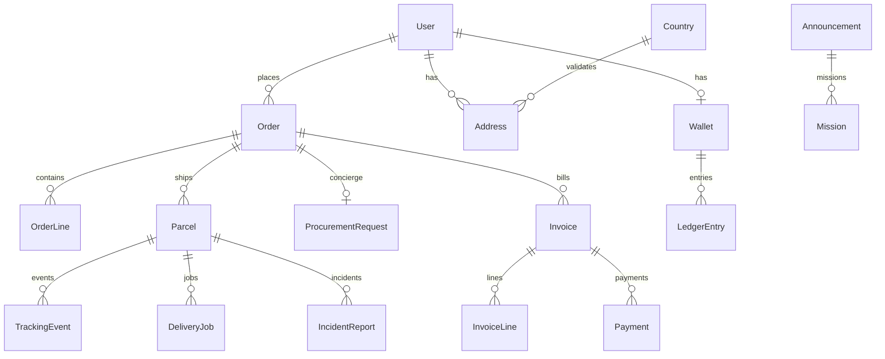

# Modèle de données (référence ER)

La **source de vérité** du schéma relationnel est [`backend/prisma/schema.prisma`](../backend/prisma/schema.prisma) (migrations dans `backend/prisma/migrations/`).

## Vue synthétique (Mermaid)

## Domaines couverts

| Domaine        | Tables principales |
| -------------- | -------------------- |
| Corridor       | `Country`, `WarehouseAddress`, `Address` |
| Commande       | `Order`, `OrderLine`, `OrderType` |
| Conciergerie   | `ProcurementRequest`, `ProcurementLine` |
| Logistique     | `Parcel`, `TrackingEvent`, `DeliveryJob`, `DriverShift` |
| Facturation    | `Invoice`, `InvoiceLine`, `Payment` |
| Paiements      | `WebhookEvent`, `PaymentProvider`, `PaymentMethodConfig` |
| Partenaires    | `Announcement`, `Mission`, `KycSubmission`, `UserApplication` |
| Finances       | `Wallet`, `LedgerEntry`, `PayoutRequest`, `CommissionStatement` |
| IAM / audit    | `User`, `AuditLog` |

Pour le détail des colonnes, contraintes et énumérations (`UserRole`, `OrderType`), ouvrir le fichier Prisma ci-dessus.
